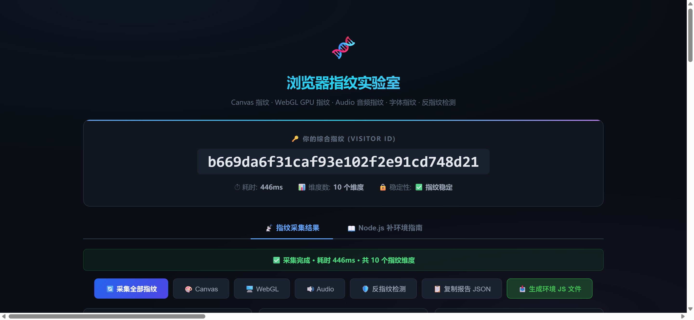

# fingerprint — 浏览器指纹采集与 Node.js 环境复现工具集

[](https://nodejs.org/)
[](LICENSE)
[](README_en.md)

完整复现 **Canvas / WebGL / Audio / 字体 / 硬件 / 时区** 六大浏览器指纹维度，覆盖
「浏览器采集 → Node.js 补环境 → 真实数据注入 → 指纹一致性验证」全流程。

既可以在真实浏览器中一键采集自己的设备指纹，也可以在 Node.js 中把这份报告注入补环境，
让无头环境输出与真实浏览器完全一致的指纹。

## 目录

- [✨ 特性](#-特性)
- [📁 目录结构](#-目录结构)
- [🚀 快速开始](#-快速开始)
- [🧰 API 速览](#-api-速览)
- [📚 实际案例](#-实际案例)
- [🧠 工作原理](#-工作原理)
- [❓ FAQ](#-faq)
- [⚠️ 免责声明](#️-免责声明)
- [License](#license)

## ✨ 特性

- **六大维度指纹采集**（`all_fp.js`）：Canvas（基础 + 高级）、WebGL（硬件参数 + 着色器像素）、
  Audio、字体、硬件、时区，浏览器与 Node.js 双环境通用
- **可视化采集页面**（`test_fp.html`）：浏览器打开 → 自动采集 → 一键复制/下载指纹报告
- **原型链级补环境**（`fp_env_patch.js`）：`instanceof`、`toString`、getter 全对齐真实浏览器，
  遵循「真实数据优先，合成数据兜底」原则
- **真实报告一键注入**：`injectRealFingerprint(report)` 自动解析报告并注入全部维度
- **设备预设 / 环境变量**：`--preset macos-chrome` 或 `FP_GPU_VENDOR=...` 快速切换设备画像
- **自包含案例**：`cases/` 目录提供可运行的实际案例

## 📁 目录结构

```
fingerprint/
├── all_fp.js                # 指纹采集函数（ES Module，浏览器 & Node 双环境）
├── fp_env_patch.js          # Node.js 补环境（Canvas/WebGL/Audio 原型链 + 注入通道）
├── fp_env_ruishu_plus.js    # 瑞数增强环境（研究示例，见免责声明）
├── test_fp.html             # 浏览器采集页面（可视化 + 一键复制报告）
├── test_fp_node.js          # Node.js 冒烟测试（--preset 切换设备画像）
├── test_e2e_ruishu.py       # 瑞数 WAF 端到端研究脚本（Python）
├── index.js                 # 早期浏览器 demo（依赖 fingerprintjs2 CDN）
├── core/                    # 各维度独立模块（canvasFP/webglFP/audioFP/netFP）
└── cases/                   # 实际案例（每个案例一个目录）
```

## 🚀 快速开始

### 1. 浏览器采集（拿真实指纹）

```bash
# 在本目录起一个静态服务
python -m http.server 8080
# 打开 http://localhost:8080/test_fp.html
# 等待自动采集完成 → 点击「📥 生成环境 JS 文件」→「📋 复制报告 JSON」
# 保存为 browser_fingerprint.json（已加入 .gitignore，请勿提交）
```



### 2. Node.js 验证

```bash
npm install            # 仅需 blueimp-md5
node test_fp_node.js   # 全维度冒烟测试

# 切换设备画像
node test_fp_node.js --preset macos-chrome
# 或环境变量
FP_GPU_VENDOR="NVIDIA" FP_GPU_RENDERER="RTX 4090" node test_fp_node.js
```

### 3. 注入真实报告

```javascript
const { injectRealFingerprint } = require('./fp_env_patch.js');
const report = require('./browser_fingerprint.json');
injectRealFingerprint(report);          // 自动解析并注入全部维度

const mod = await import('./all_fp.js');
const fp = new mod.BrowserFingerprinter();
const result = await fp.getFingerprint();
// result.visitorId 应与浏览器端报告一致
```

> 💡 完整可运行示例见 `cases/01_parity_demo/`。

## 🧰 API 速览

### all_fp.js（指纹采集，ES Module）

| 分类 | 导出 | 说明 |
|------|------|------|
| 工具 | `hashString` / `md5Hash` | 字符串哈希 / MD5 |
| Canvas | `getCanvasFingerprint()` | 基础画布指纹（200x50） |
| | `getCanvasFingerprintAdvanced()` | 高级画布指纹（280x60，含 Farbling 稳定性检测） |
| WebGL | `getWebGLContext()` | 获取 WebGL 上下文 |
| | `getWebGLFingerprint()` | GPU 硬件参数（厂商/渲染器/上限/扩展） |
| | `getAdvancedWebGLFingerprint()` | 着色器像素级指纹 |
| Audio | `getAudioFingerprint(timeoutMs)` | 音频渲染波形指纹（异步） |
| 字体 | `getFontFingerprint(testFonts?)` | 已安装字体检测（16 字体候选） |
| 硬件 | `getHardwareFingerprint()` | CPU 核心/内存/触点数/平台 |
| 时区 | `getTimezoneFingerprint()` | 时区 + 偏移 + 语言 |
| 检测 | `detectCanvasFarbling()` | Canvas 噪声检测（Brave 类） |
| | `detectWebGLInterception()` | GPU 信息拦截检测 |
| | `detectUAReduction()` | UA 缩减检测 |
| 综合 | `BrowserFingerprinter`（class） | `.getComponents()` / `.getFingerprint()`（→ `{visitorId, components}`）/ `.getShortFingerprint()` |
| | `BrowserFP` | FingerprintJS 兼容接口：`.load()` / `.getVisitorId()` |

### fp_env_patch.js（Node 补环境，CommonJS）

| 导出 | 说明 |
|------|------|
| `setFingerprintConfig({...})` | 覆盖任意指纹配置项 |
| `injectRealFingerprint(report)` | 一键注入 test_fp.html 采集的报告 |
| `applyPreset(name)` / `PRESETS` | 设备画像预设：`windows-chrome` / `macos-chrome` / `linux-chrome` / `ios-safari` |
| `FP_CONFIG` | 当前配置对象（六大维度 + 注入槽位） |
| `updateFunToString` / `setNativeTag` / `defProp` | 原型链 / toString 伪装工具 |
| `Window` / `Navigator` / `Document` / `HTMLCanvasElement` / `WebGLRenderingContext` / `OfflineAudioContext` … | 环境构造函数（供外部扩展） |

## 📚 实际案例

见 [`cases/`](cases/README.md)——案例库以**辅助理解**为定位，配套：

- **反爬分层模型**：把反爬看成六层塔（传输 → 挑战 → 环境 → 签名 → 行为 → 合规），每个案例标了所属层级
- **现象速查表**：遇到 403/412/405/521/签名参数/滑块……直接查该看哪个案例
- **阅读路线**：新手路线 / 指纹主线 / WAF 主线 / 签名主线 / 行为与合规
- **术语速查**：JA3、JSVMP、补环境、纯算、魔改哈希、风控联动等

案例总览：

| # | 案例 | 类型 | 说明 |
|---|------|------|------|
| 1 | `cases/01_parity_demo` | 🔧 可运行 | 报告注入 → Node 输出与浏览器一致性验证（自包含，无需目标站点） |
| 2 | `cases/02_ruishu_caict` | 🔧 可运行 | 瑞数 WAF 端到端研究流程（412 → 补环境 → cookie → 验证） |
| 3 | `cases/03_akamai_bot_manager` | 📖 文档 | Akamai sensor_data / _abck 风控 + TLS 指纹 |
| 4 | `cases/04_jd_h5st` | 📖 文档 | 京东 h5st 动态签名（魔改哈希 + 字节码 VM + 环境指纹） |
| 5 | `cases/05_boss_zhipin` | 📖 文档 | BOSS 直聘 __zp_stoken__ 动态令牌 + Canvas 指纹 |
| 6 | `cases/06_device_sdk` | 📖 文档 | 国内风控设备指纹 SDK 采集面（数美/顶象/极验） |
| 7 | `cases/07_cloudflare` | 📖 文档 | Cloudflare TLS 指纹 + Turnstile 隐形验证 |
| 8 | `cases/08_tls_fingerprint` | 🔧 可运行 | TLS 指纹：requests 拿不到、curl_cffi 能拿到（北大信研院实战 + 对比脚本） |
| 9 | `cases/09_behavioral` | 📖 文档 | 行为/轨迹指纹：极验/顶象滑块轨迹「行为即验证」 |
| 10 | `cases/10_webrtc` | 📖 文档 | WebRTC 指纹：代理下真实 IP 泄露（STUN/mDNS/IPv6） |
| 11 | `cases/11_automation_detection` | 📖 文档 | 自动化检测：webdriver 标记、CDP 暴露与 stealth 对抗 |
| 12 | `cases/12_font` | 📖 文档 | 字体反爬（字形映射）+ 字体指纹（安装列表） |
| 13 | `cases/13_aws_waf` | 📖 文档 | AWS WAF Bot Control：405 挑战 + 视觉验证码 |
| 14 | `cases/14_jiasule_521` | 📖 文档 | 加速乐 521：双层挑战 + Cookie 增量语义 |
| 15 | `cases/15_douyin_a_bogus` | 📖 文档 | 抖音 a_bogus 动态签名 |
| 16 | `cases/16_xiaohongshu_xs` | 📖 文档 | 小红书 x-s/shield 签名族 |
| 17 | `cases/17_zhihu_x_zse_96` | 📖 文档 | 知乎 x-zse-96 签名 |
| 18 | `cases/18_netease_weapi` | 📖 文档 | 网易云 weapi 两段式接口加密 |
| 19 | `cases/19_compliance` | 📖 合规 | 爬虫司法判例与合法边界 |

## 🧠 工作原理

### 六大维度

| 维度 | 原理 | 注入字段 |
|------|------|---------|
| Canvas | 不同系统的字体渲染/抗锯齿/颜色空间差异 → `toDataURL` 字节级不同 | `canvasDataURL` / `canvasDataURLAdvanced` |
| WebGL | GPU 型号、驱动、着色器浮点精度差异 | `webglVendorRaw` / `webglRendererRaw` / `webglShaderPixelsRaw` / `gpuMaxViewportDims` 等 |
| Audio | 音频栈与浮点精度差异 → 波形采样点不同 | `audioRawSamples` |
| 字体 | 已安装字体集合 + 渲染宽度差异 | `fontWidthsRaw`（字体名 → 宽度映射） |
| 硬件 | CPU 核心数 / 内存 / 触点数 / 平台 | `hardwareConcurrency` / `deviceMemory` / `platform` 等 |
| 时区 | IANA 时区 + UTC 偏移 + 语言列表 | `timezone` / `timezoneOffset` / `languages` |

### 补环境方法论（5 阶段）

1. **枚举 API** — 静态搜索目标脚本用到的浏览器 API
2. **全局骨架** — `window = global` + 原型链挂载，清理 Node 痕迹
3. **逐维度补实现** — 每个指纹维度「真实数据优先，合成数据兜底」
4. **toString 伪装** — `Function.prototype.toString` 劫持，返回 `[native code]`
5. **验证** — 浏览器 vs Node 逐项对比（`test_fp_node.js`）

## ❓ FAQ

**Q: 运行时出现 `MODULE_TYPELESS_PACKAGE_JSON` 警告？**
无害。`all_fp.js` 是 ES Module 但仓库 `package.json` 没有声明 `"type": "module"`
（声明了会让 CommonJS 的 `fp_env_patch.js` 失效），Node 靠语法探测自动识别，只是顺手警告。
想消除它：把 `all_fp.js` 复制为 `all_fp.mjs` 并改 import 路径即可，不复制也不影响任何功能。

**Q: Node 版本要求？**
推荐 **Node 22+**（默认开启 ESM 语法探测）。20.x 需加 `--experimental-detect-module` 标志。

**Q: Python 脚本的依赖？**
```bash
pip install -r requirements.txt   # requests + curl_cffi
```

**Q: test_fp.html 必须起服务吗？**
是的，它通过 import map 从 CDN 加载 `blueimp-md5`，`file://` 协议下模块加载会失败：
`python -m http.server 8080` 后访问 `http://localhost:8080/test_fp.html`。

**Q: 真实浏览器报告可以提交吗？**
不要。`browser_fingerprint.json` 已加入 `.gitignore`——它含你设备的真实指纹。

## ⚠️ 免责声明

本项目仅供**学习与研究**浏览器指纹技术、Web 安全与逆向工程使用。

- 请勿将本项目用于任何非法用途、未授权的系统访问，或违反目标网站服务条款的爬取行为
- `test_e2e_ruishu.py` / `fp_env_ruishu_plus.js` 演示的是瑞数 WAF 的通用挑战-响应流程，
  目标站点仅作为公开演示对象，请遵守相关法律法规
- 使用者需对自身行为承担全部责任

## License

[MIT](LICENSE) © 2026 JimmySmile
